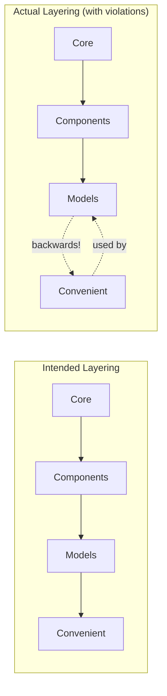
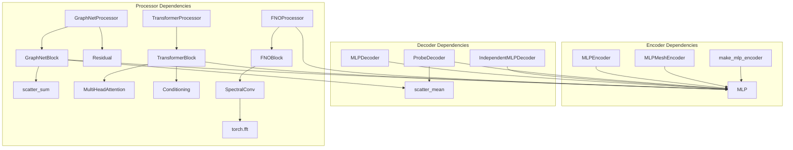
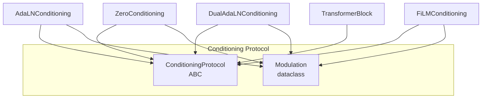
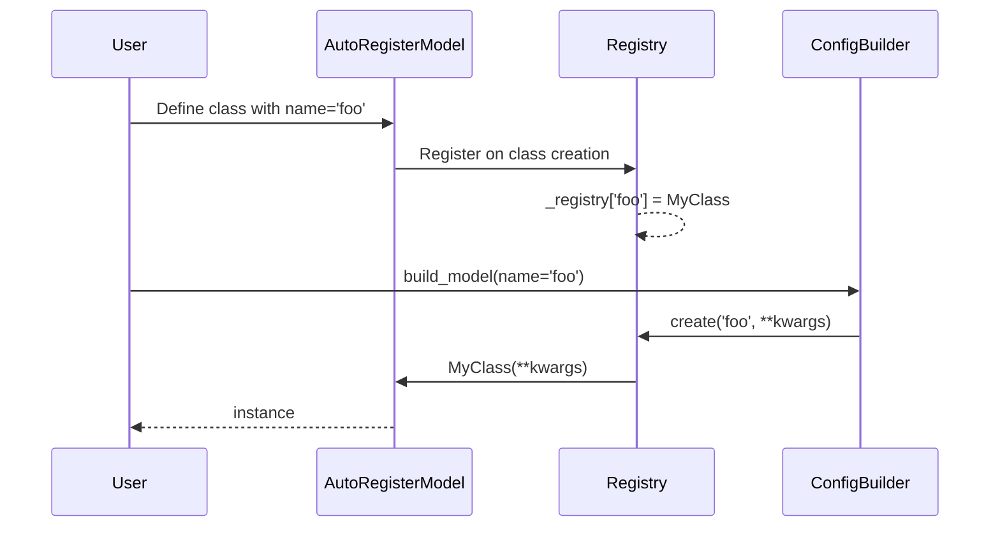
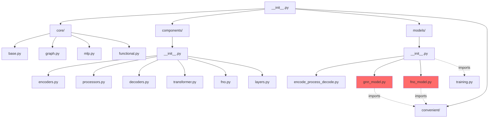
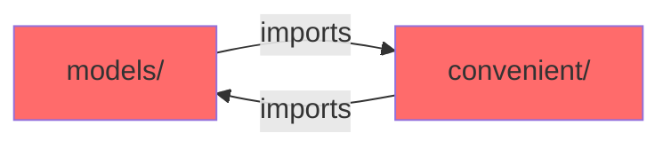
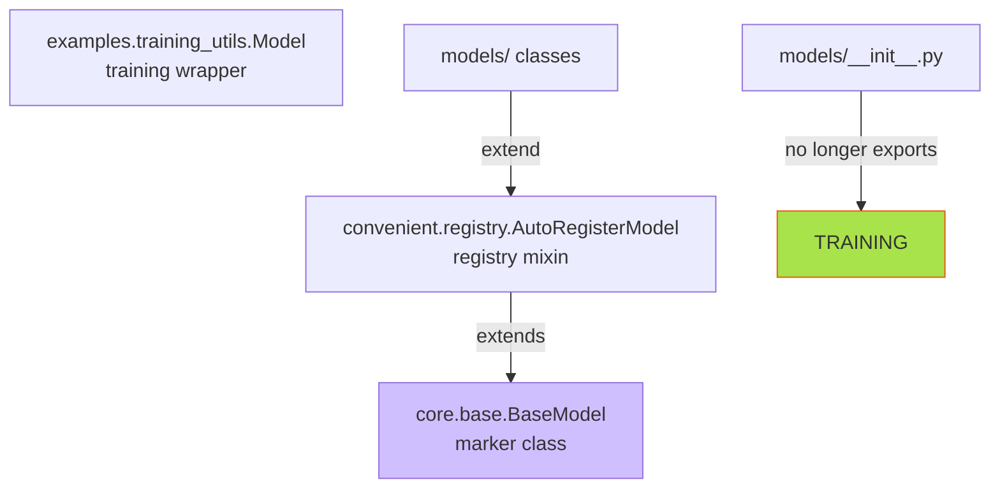
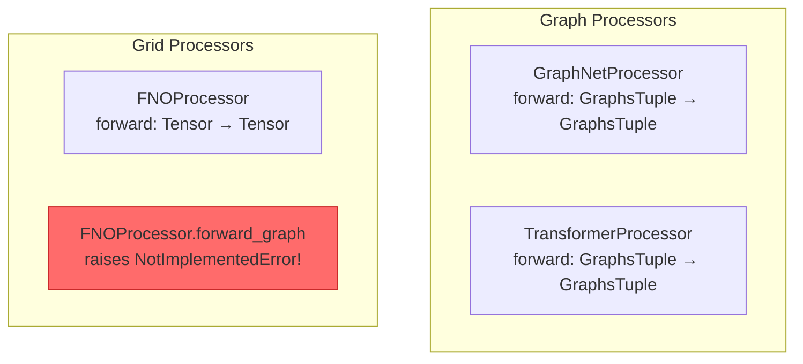

# GNN-PDE v2 Architecture & Dependency Map

## Module Dependency Graph

```mermaid
graph TB
    subgraph "External Dependencies"
        TORCH[torch]
        NUMPY[numpy]
        PYDANTIC[pydantic]
        TORCH_CLUSTER[torch_cluster]
        TORCH_SCATTER[torch_scatter]
    end

    subgraph "Core Layer"
        BASE[core.base<br/>BaseModel]
        GRAPH[core.graph<br/>GraphsTuple]
        MLP[core.mlp<br/>MLP, SinActivation]
        FUNC[core.functional<br/>scatter_*, aggregate_*]
    end

    subgraph "Components Layer"
        ENC[components.encoders<br/>MLPEncoder, MLPMeshEncoder]
        DEC[components.decoders<br/>MLPDecoder, IndependentMLPDecoder]
        PROC[components.processors<br/>GraphNetBlock, GraphNetProcessor]
        TRANS[components.transformer<br/>TransformerBlock, Conditioning]
        FNO[components.fno<br/>SpectralConv, FNOBlock, FNOProcessor]
        LAYERS[components.layers<br/>Residual variants]
        PROBE[components.probe<br/>ProbeDecoder]
        FOURIER[components.fourier_encoder<br/>FourierFeatureEncoder]
    end

    subgraph "Models Layer"
        EPD[models.encode_process_decode<br/>EncodeProcessDecode]
        GNN_MODEL[models.gnn_model<br/>GraphNet, MeshGraphNet]
        FNO_MODEL[models.fno_model<br/>FNO, TFNO, AFNO]
        UNIFIED[models.unified_model<br/>UnifiedModel]
    end

    subgraph "Convenient Layer"
        REGISTRY[convenient.registry<br/>AutoRegisterModel]
        CONFIG[convenient.config<br/>*Config classes]
        INIT[convenient.initializers<br/>get_initializer]
        AGG[convenient.aggregation<br/>scatter_min, scatter_softmax]
    end

    subgraph "Examples"
        EX_MESH[examples.example_meshgraphnets<br/>MeshGraphNets]
        EX_DEEP[examples.example_deepxde<br/>DeepXDE]
        EX_FNO[examples.example_neuraloperator_fno<br/>FNO]
        EX_TRANS[examples.example_transolver<br/>Transolver]
        EX_UNI[examples.example_unisolver<br/>Unisolver]
    end

    subgraph "Utils"
        GRAPH_UTILS[utils.graph_utils<br/>knn_graph, radius_graph]
        SPATIAL[utils.spatial_utils<br/>spatial computations]
    end

    %% Core dependencies
    BASE --> TORCH
    GRAPH --> TORCH
    MLP --> TORCH
    MLP --> BASE
    FUNC --> TORCH
    FUNC --> TORCH_SCATTER

    %% Components depend on Core
    ENC --> MLP
    ENC --> GRAPH
    DEC --> MLP
    DEC --> GRAPH
    PROC --> MLP
    PROC --> GRAPH
    PROC --> FUNC
    TRANS --> MLP
    TRANS --> GRAPH
    FNO --> MLP
    LAYERS --> TORCH
    PROBE --> MLP
    PROBE --> FUNC
    FOURIER --> TORCH

    %% Models depend on Components AND Core
    EPD --> GRAPH
    EPD --> ENC
    EPD --> PROC
    EPD --> DEC

    GNN_MODEL --> GRAPH
    GNN_MODEL --> ENC
    GNN_MODEL --> PROC
    GNN_MODEL --> DEC

    FNO_MODEL --> FNO

    %% CRITICAL: Models depend on Convenient (violation!)
    GNN_MODEL -.->|VIOLATION| REGISTRY
    FNO_MODEL -.->|VIOLATION| REGISTRY

    %% Convenient dependencies
    REGISTRY --> BASE
    REGISTRY --> PYDANTIC
    CONFIG --> PYDANTIC
    BUILDER --> CONFIG
    BUILDER --> GNN_MODEL
    BUILDER --> FNO_MODEL
    BUILDER --> EPD
    BUILDER --> REGISTRY
    TRAINING --> TORCH
    INIT --> TORCH
    AGG --> TORCH_SCATTER

    %% Examples depend on everything
    EX_MESH --> GRAPH
    EX_MESH --> PROC
    EX_MESH --> REGISTRY

    EX_DEEP --> MLP
    EX_DEEP --> FOURIER

    EX_FNO --> FNO_MODEL

    EX_TRANS --> TRANS
    EX_UNI --> TRANS

    %% Utils dependencies
    GRAPH_UTILS --> TORCH
    GRAPH_UTILS --> TORCH_CLUSTER

    %% Styling
    classDef violation fill:#ff6b6b,stroke:#c92a2a,stroke-width:3px
    classDef core fill:#d0bfff,stroke:#7950f2
    classDef component fill:#a9e34b,stroke:#5c940d
    classDef model fill:#ffd43b,stroke:#fab005
    classDef convenient fill:#ff922b,stroke:#e8590c

    class GNN_MODEL,FNO_MODEL violation
    class BASE,GRAPH,MLP,FUNC core
    class ENC,DEC,PROC,TRANS,FNO,LAYERS,PROBE,FOURIER component
    class EPD,UNIFIED model
    class REGISTRY,CONFIG,BUILDER,TRAINING,INIT,AGG convenient
```

## Intended vs Actual Layering

## Component Internal Dependencies

## Conditioning System Dependencies

## Registry & Auto-Registration Flow

## Import Graph (Simplified)

## Key Issues Highlighted

### 1. Circular Dependency Risk

### 2. Two Model Classes Confusion (RESOLVED)

### 3. FNO vs Graph Processor Mismatch

## Summary

| Layer | Depends On | Should Depend On | Issue |
|-------|------------|------------------|-------|
| `core/` | torch, numpy | torch, numpy | ✅ OK |
| `components/` | core | core | ✅ OK |
| `models/` | components | components only | ✅ FIXED (training moved to examples) |
| `convenient/` | core, components, models | core, components | ⚠️ Acceptable |
| `examples/` | all | all | ✅ OK (top level) |
| `utils/` | torch_cluster (hard) | optional | ⚠️ Should be optional |
