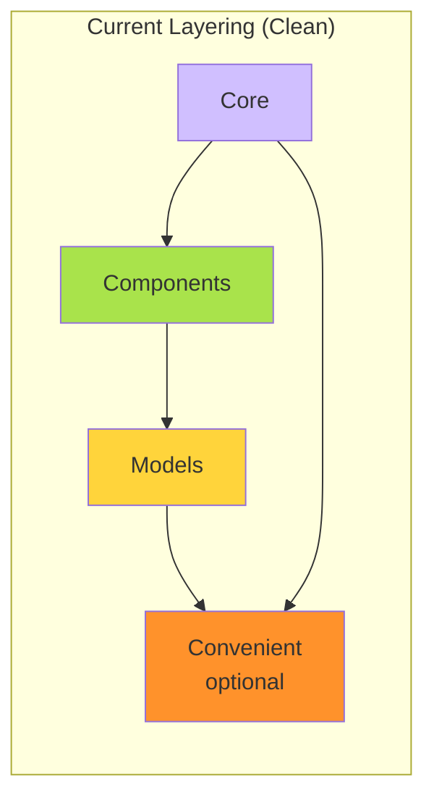
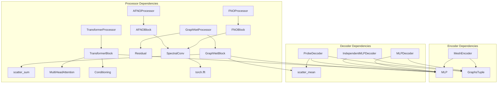
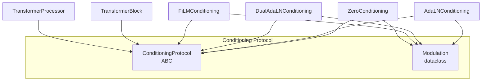
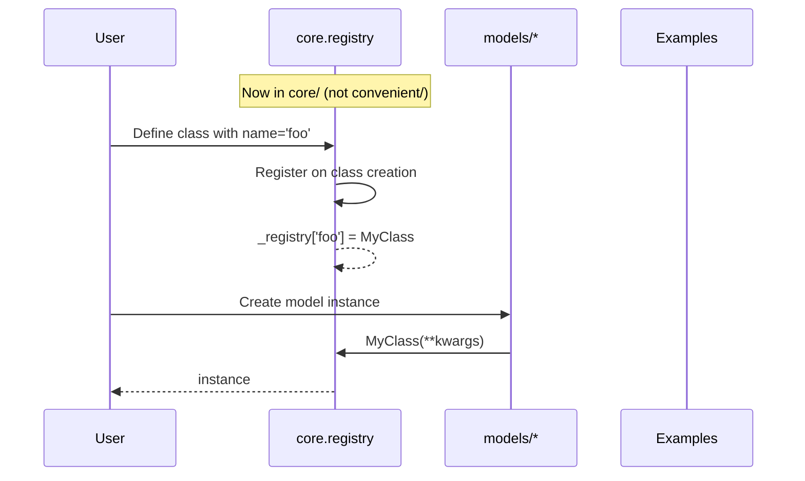
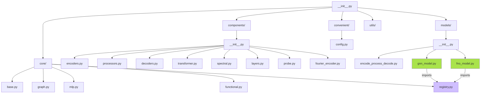
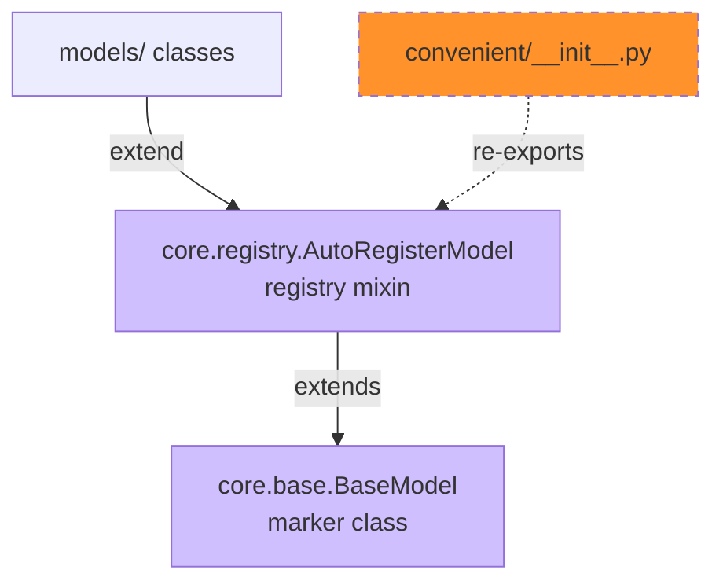
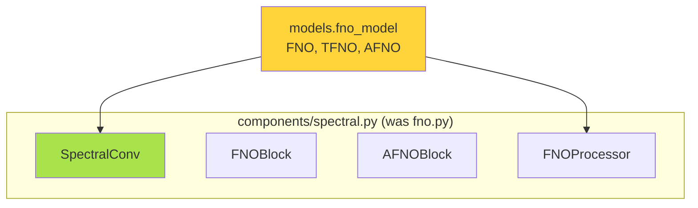
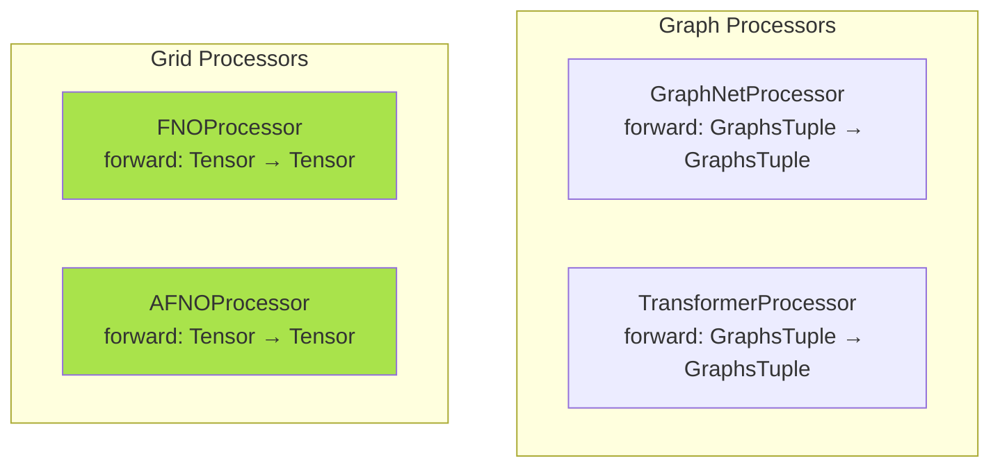
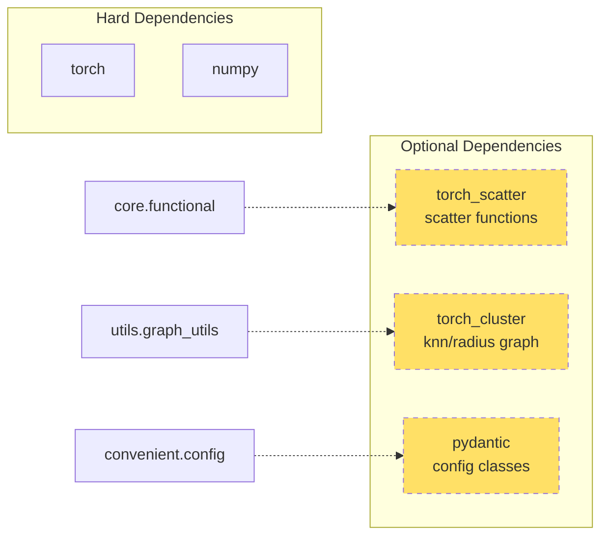

# GNN-PDE v2 Architecture & Dependency Map

## Module Dependency Graph

```mermaid
graph TB
    subgraph "External Dependencies"
        TORCH[torch]
        NUMPY[numpy]
        PYDANTIC[pydantic<br/>optional]
        TORCH_CLUSTER[torch_cluster<br/>optional]
        TORCH_SCATTER[torch_scatter<br/>optional]
    end

    subgraph "Core Layer"
        BASE[core.base<br/>BaseModel]
        GRAPH[core.graph<br/>GraphsTuple]
        MLP[core.mlp<br/>MLP, SinActivation]
        FUNC[core.functional<br/>scatter_*, aggregate_*]
        REGISTRY[core.registry<br/>AutoRegisterModel]
    end

    subgraph "Components Layer"
        ENC[components.encoders<br/>MeshEncoder]
        DEC[components.decoders<br/>MLPDecoder, IndependentMLPDecoder]
        PROC[components.processors<br/>GraphNetBlock, GraphNetProcessor]
        TRANS[components.transformer<br/>TransformerBlock, Conditioning]
        SPECTRAL[components.spectral<br/>SpectralConv, FNOBlock, AFNOBlock, FNOProcessor]
        LAYERS[components.layers<br/>Residual, GatedResidual]
        PROBE[components.probe<br/>ProbeDecoder, ProbeMessagePassingLayer]
        FOURIER[components.fourier_encoder<br/>FourierFeatureEncoder]
    end

    subgraph "Models Layer"
        EPD[models.encode_process_decode<br/>EncodeProcessDecode]
        GNN_MODEL[models.gnn_model<br/>GraphNet, MeshGraphNet]
        FNO_MODEL[models.fno_model<br/>FNO, TFNO, AFNO]
    end

    subgraph "Convenient Layer"
        CONFIG[convenient.config<br/>*Config classes]
    end

    subgraph "Examples"
        EX_MESH[examples.example_meshgraphnets]
        EX_DEEP[examples.example_deepxde]
        EX_FNO[examples.example_neuraloperator_fno]
        EX_TRANS[examples.example_transolver]
        EX_UNI[examples.example_unisolver]
        TRAINING[examples.training_utils<br/>Model, LossFunction]
    end

    subgraph "Utils"
        GRAPH_UTILS[utils.graph_utils<br/>knn_graph, radius_graph]
        SPATIAL[utils.spatial_utils<br/>grid_to_points, points_to_grid]
    end

    %% Core dependencies
    BASE --> TORCH
    GRAPH --> TORCH
    MLP --> TORCH
    MLP --> BASE
    FUNC --> TORCH
    FUNC -.->|optional| TORCH_SCATTER
    REGISTRY --> BASE

    %% Components depend on Core
    ENC --> MLP
    ENC --> GRAPH
    DEC --> MLP
    DEC --> GRAPH
    PROC --> MLP
    PROC --> GRAPH
    PROC --> FUNC
    TRANS --> MLP
    TRANS --> GRAPH
    SPECTRAL --> TORCH
    SPECTRAL --> NUMPY
    LAYERS --> TORCH
    PROBE --> MLP
    PROBE --> GRAPH
    PROBE --> FUNC
    FOURIER --> TORCH
    FOURIER --> GRAPH

    %% Models depend on Components AND Core (CLEAN - no violations!)
    EPD --> GRAPH
    EPD --> BASE

    GNN_MODEL --> GRAPH
    GNN_MODEL --> MLP
    GNN_MODEL --> REGISTRY
    GNN_MODEL --> ENC
    GNN_MODEL --> PROC
    GNN_MODEL --> DEC
    GNN_MODEL --> EPD

    FNO_MODEL --> REGISTRY
    FNO_MODEL --> SPECTRAL

    %% Convenient dependencies (optional sugar layer)
    CONFIG -.->|optional| PYDANTIC

    %% Examples depend on everything
    EX_MESH --> GRAPH
    EX_MESH --> PROC
    EX_MESH --> REGISTRY

    EX_DEEP --> MLP
    EX_DEEP --> FOURIER

    EX_FNO --> FNO_MODEL

    EX_TRANS --> TRANS
    EX_UNI --> TRANS

    TRAINING --> TORCH

    %% Utils dependencies
    GRAPH_UTILS --> TORCH
    GRAPH_UTILS --> GRAPH
    GRAPH_UTILS -.->|optional| TORCH_CLUSTER

    SPATIAL --> TORCH
    SPATIAL --> GRAPH

    %% Styling
    classDef core fill:#d0bfff,stroke:#7950f2
    classDef component fill:#a9e34b,stroke:#5c940d
    classDef model fill:#ffd43b,stroke:#fab005
    classDef convenient fill:#ff922b,stroke:#e8590c
    classDef example fill:#74c0fc,stroke:#339af0
    classDef optional fill:#ffe066,stroke:#fab005,stroke-dasharray: 5 5

    class BASE,GRAPH,MLP,FUNC,REGISTRY core
    class ENC,DEC,PROC,TRANS,SPECTRAL,LAYERS,PROBE,FOURIER component
    class EPD,GNN_MODEL,FNO_MODEL model
    class CONFIG convenient
    class EX_MESH,EX_DEEP,EX_FNO,EX_TRANS,EX_UNI,TRAINING example
```

## Layer Architecture (CLEAN - No Violations)

```mermaid
graph LR
    subgraph "Current Layering (Clean)"
        direction TB
        C1[Core] --> C2[Components] --> C3[Models]
        C3 --> C4[Convenient<br/>optional]
        C1 --> C4
    end

    style C1 fill:#d0bfff
    style C2 fill:#a9e34b
    style C3 fill:#ffd43b
    style C4 fill:#ff922b
```

## Component Internal Dependencies

```mermaid
graph TB
    subgraph "Encoder Dependencies"
        MESHE[MeshEncoder] --> MLP
        MESHE --> GraphsTuple
    end

    subgraph "Decoder Dependencies"
        MLPD[MLPDecoder] --> MLP
        MLPD --> GraphsTuple
        INDD[IndependentMLPDecoder] --> MLP
        INDD --> GraphsTuple
        PROBED[ProbeDecoder] --> MLP
        PROBED --> GraphsTuple
        PROBED --> scatter_mean
    end

    subgraph "Processor Dependencies"
        GN_B[GraphNetBlock] --> MLP
        GN_B --> scatter_sum
        GN_B --> scatter_mean
        GNP[GraphNetProcessor] --> GN_B
        GNP --> Residual

        T_B[TransformerBlock] --> MLP
        T_B --> MultiHeadAttention
        T_B --> Conditioning
        TP[TransformerProcessor] --> T_B

        SPEC[SpectralConv] --> torch.fft
        FNO_B[FNOBlock] --> SPEC
        AFNO_B[AFNOBlock] --> SPEC
        FNOP[FNOProcessor] --> FNO_B
        AFNOP[AFNOProcessor] --> AFNO_B
    end
```

## Conditioning System Dependencies

```mermaid
graph TB
    subgraph "Conditioning Protocol"
        PROTO[ConditioningProtocol<br/>ABC]
        MOD[Modulation<br/>dataclass]
    end

    ZERO[ZeroConditioning]
    ADA[AdaLNConditioning]
    DUAL[DualAdaLNConditioning]
    FILM[FiLMConditioning]

    ZERO --> PROTO
    ADA --> PROTO
    DUAL --> PROTO
    FILM --> PROTO

    ADA --> MOD
    DUAL --> MOD
    FILM --> MOD
    ZERO --> MOD

    TRANS_C[TransformerBlock] --> PROTO
    TRANS_P[TransformerProcessor] --> PROTO
```

## Registry & Auto-Registration Flow

```mermaid
sequenceDiagram
    participant User
    participant AutoRegisterModel as core.registry
    participant Models as models/*
    participant Examples

    Note over AutoRegisterModel: Now in core/ (not convenient/)

    User->>AutoRegisterModel: Define class with name='foo'
    AutoRegisterModel->>AutoRegisterModel: Register on class creation
    AutoRegisterModel-->>AutoRegisterModel: _registry['foo'] = MyClass

    User->>Models: Create model instance
    Models->>AutoRegisterModel: MyClass(**kwargs)
    AutoRegisterModel-->>User: instance
```

## Import Graph (Simplified)

```mermaid
graph TD
    ROOT[__init__.py]

    ROOT --> CORE[core/]
    ROOT --> COMP[components/]
    ROOT --> MODELS[models/]
    ROOT --> CONV[convenient/]
    ROOT --> UTILS[utils/]

    CORE --> BASE[base.py]
    CORE --> GRAPH[graph.py]
    CORE --> MLP[mlp.py]
    CORE --> FUNC[functional.py]
    CORE --> REGISTRY[registry.py]

    COMP --> INIT_COMP[__init__.py]
    INIT_COMP --> ENC[encoders.py]
    INIT_COMP --> PROC[processors.py]
    INIT_COMP --> DEC[decoders.py]
    INIT_COMP --> TRANS[transformer.py]
    INIT_COMP --> SPECTRAL[spectral.py]
    INIT_COMP --> LAYERS[layers.py]
    INIT_COMP --> PROBE[probe.py]
    INIT_COMP --> FOURIER[fourier_encoder.py]

    MODELS --> INIT_MODELS[__init__.py]
    INIT_MODELS --> EPD[encode_process_decode.py]
    INIT_MODELS --> GNN[gnn_model.py]
    INIT_MODELS --> FNO_M[fno_model.py]

    CONV --> CONFIG[config.py]

    %% Cross-layer imports (all clean now!)
    GNN -->|imports| REGISTRY
    FNO_M -->|imports| REGISTRY

    style GNN fill:#a9e34b
    style FNO_M fill:#a9e34b
    style REGISTRY fill:#d0bfff
```

## Key Architecture Decisions

### 1. Registry in Core Layer (RESOLVED)

```mermaid
graph TD
    BASE[core.base.BaseModel<br/>marker class]
    REGISTRY[core.registry.AutoRegisterModel<br/>registry mixin]

    REGISTRY -->|extends| BASE
    MODELS[models/ classes] -->|extend| REGISTRY

    CONV_REEXPORT[convenient/__init__.py] -.->|re-exports| REGISTRY

    style REGISTRY fill:#d0bfff
    style BASE fill:#d0bfff
    style CONV_REEXPORT fill:#ff922b,stroke-dasharray: 5 5
```

**Rationale**: Moving `AutoRegisterModel` to `core/` eliminates the layer violation where models had to import from `convenient/`.

### 2. Spectral Components (RENAMED)

```mermaid
graph TD
    subgraph "components/spectral.py (was fno.py)"
        SPEC[SpectralConv]
        FNO_B[FNOBlock]
        AFNO_B[AFNOBlock]
        FNOP[FNOProcessor]
    end

    FNO_MODEL[models.fno_model<br/>FNO, TFNO, AFNO] --> FNOP
    FNO_MODEL --> SPEC

    style SPEC fill:#a9e34b
    style FNO_MODEL fill:#ffd43b
```

**Rationale**: Renamed `fno.py` to `spectral.py` to better reflect that it contains general spectral convolution components.

### 3. FNO vs Graph Processor Mismatch

```mermaid
graph TD
    subgraph "Graph Processors"
        GNP[GraphNetProcessor<br/>forward: GraphsTuple → GraphsTuple]
        TP[TransformerProcessor<br/>forward: GraphsTuple → GraphsTuple]
    end

    subgraph "Grid Processors"
        FNOP[FNOProcessor<br/>forward: Tensor → Tensor]
        AFNOP[AFNOProcessor<br/>forward: Tensor → Tensor]
    end

    style FNOP fill:#a9e34b
    style AFNOP fill:#a9e34b
```

**Note**: Grid processors work on tensors directly, not GraphsTuple. This is intentional - use `FNO`/`TFNO`/`AFNO` models for grid-based data.

### 4. Optional Dependencies

```mermaid
graph LR
    subgraph "Hard Dependencies"
        TORCH[torch]
        NUMPY[numpy]
    end

    subgraph "Optional Dependencies"
        SCATTER[torch_scatter<br/>scatter functions]
        CLUSTER[torch_cluster<br/>knn/radius graph]
        PYDANTIC[pydantic<br/>config classes]
    end

    FUNC[core.functional] -.-> SCATTER
    GRAPH_UTILS[utils.graph_utils] -.-> CLUSTER
    CONFIG[convenient.config] -.-> PYDANTIC

    style SCATTER fill:#ffe066,stroke-dasharray: 5 5
    style CLUSTER fill:#ffe066,stroke-dasharray: 5 5
    style PYDANTIC fill:#ffe066,stroke-dasharray: 5 5
```

**Fallbacks**:
- `torch_scatter`: Pure PyTorch fallback in `core.functional`
- `torch_cluster`: Required for `knn_graph`, `radius_graph` in utils
- `pydantic`: Required for `convenient.config` classes

## Summary

| Layer | Depends On | Status |
|-------|------------|--------|
| `core/` | torch, numpy | OK |
| `components/` | core | OK |
| `models/` | core, components | OK (clean!) |
| `convenient/` | core, pydantic (optional) | OK |
| `examples/` | all | OK (top level) |
| `utils/` | core, torch_cluster (optional) | OK |

## Module Exports Reference

### core/__init__.py
- `GraphsTuple`, `batch_graphs`, `unbatch_graphs`
- `BaseModel`
- `scatter_sum`, `scatter_mean`, `scatter_max`, `scatter_min`, `scatter_softmax`
- `aggregate_edges`, `broadcast_nodes_to_edges`
- `MLP`, `SinActivation`
- `AutoRegisterModel`

### components/__init__.py
- `FourierFeatureEncoder`
- `Residual`, `GatedResidual`, `make_residual`
- `MeshEncoder`
- `GraphNetBlock`, `GraphNetProcessor`
- `TransformerBlock`, `TransformerProcessor`, `MultiHeadAttention`, `PhysicsTokenAttention`
- `Modulation`, `ConditioningProtocol`, `ZeroConditioning`, `AdaLNConditioning`, `DualAdaLNConditioning`, `FiLMConditioning`
- `SpectralConv`, `FNOBlock`, `AFNOBlock`, `FNOProcessor`
- `MLPDecoder`, `IndependentMLPDecoder`
- `ProbeDecoder`, `ProbeMessagePassingLayer`

### models/__init__.py
- `EncodeProcessDecode`
- `FNO`, `TFNO`, `AFNO`
- `GraphNet`, `MeshGraphNet`

### convenient/__init__.py
- `AutoRegisterModel` (re-exported from core)
- `ModelConfig`, `TrainingConfig`, `FNOConfig`, `GNNConfig`, `ExperimentConfig` (if pydantic available)

### utils/__init__.py
- `compute_edge_features`, `knn_graph`, `radius_graph`
- `grid_to_points`, `points_to_grid`
