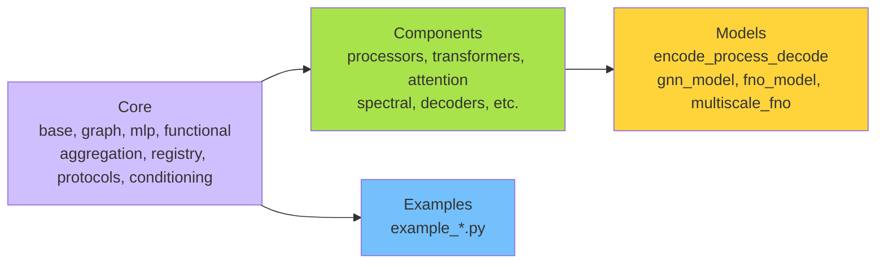
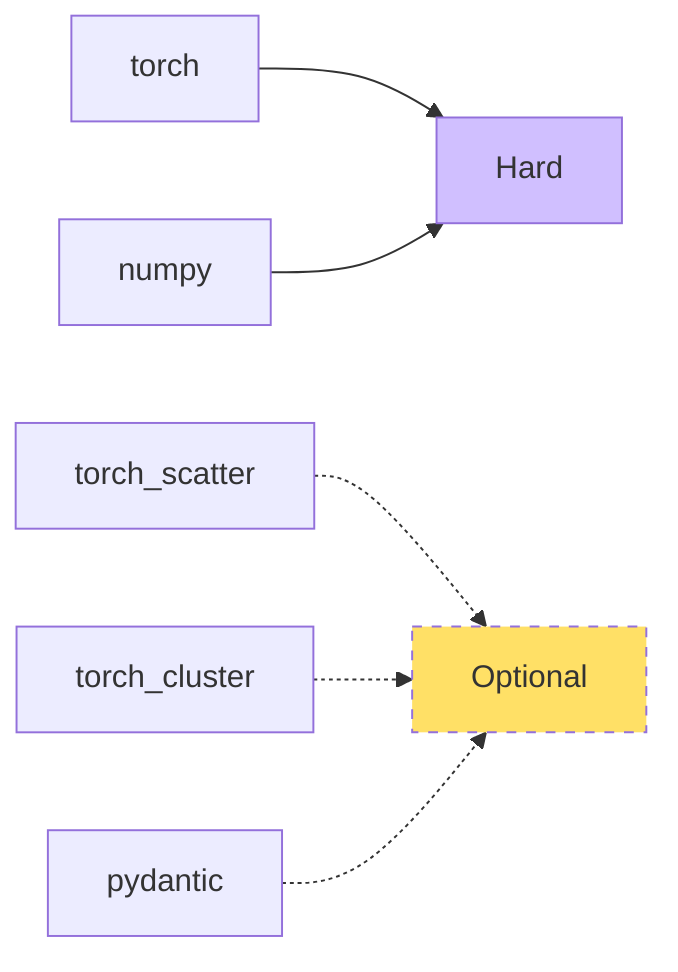

# GNN-PDE v2 Architecture & Dependency Map

## Module Dependency Graph


```mermaid
graph TB
    subgraph "External Dependencies"
        TORCH[torch]
        NUMPY[numpy]
        PYDANTIC[pydantic<br/>optional]
        TORCH_CLUSTER[torch_cluster<br/>optional]
        TORCH_SCATTER[torch_scatter<br/>optional]
    end

    subgraph "Core Layer"
        BASE[core.base<br/>BaseModel]
        GRAPH[core.graph<br/>GraphsTuple, GraphTopology]
        MLP[core.mlp<br/>MLP, SinActivation]
        FUNC[core.functional<br/>scatter_*, aggregate_*]
        AGG[core.aggregation<br/>Aggregation, Sum, Mean, Max, Min]
        REG[core.registry<br/>AutoRegisterModel, MODEL_REGISTRY]
        PROT[core.protocols<br/>GraphProcessor, NodeUpdateStrategy,<br/>EdgeMessageProcessor, NodeDecoder, QueryDecoder, etc.<br/>structural Protocols only]
        CONDCORE[core.conditioning<br/>Modulation, ConditioningProtocol<br/>nominal ABCs]
    end

    subgraph "Components Layer"
        PROC[components.processors<br/>GraphNetBlock, MessagePassingBase, GENBlock]
        EDGEPROC[components.edge_processors<br/>FullEdgeMessageProcessor,<br/>LowRankEdgeMessageProcessor, ...]
        EDGEASM[components.edge_assemblers<br/>NodeDifferenceAssembler,<br/>ConcatAssembler, ...]
        NODEUP[components.node_updaters<br/>ConcatMLPNodeUpdater,<br/>RootWeightNodeUpdater, ...]
        VAL[components.processor_validators<br/>verify_edge_message_pipeline, ...]
        GCN[components.gcn<br/>GCNBlock, GCNBlockWithEdgeFeatures]
        TRANS[components.transformer<br/>TransformerBlock, TransformerProcessor]
        ATTN[components.attention<br/>MultiHeadAttention, PhysicsTokenAttention,<br/>QKNorm, SparseGraphAttention]
        COND[components.conditioning<br/>AdaLN, DualAdaLN, FiLM, ZeroConditioning]
        TEMP[components.temperature<br/>TemperatureBase, AdaptiveTemperature, AnnealedTemperature]
        SPECT[components.spectral<br/>SpectralConv, FNOBlock, AFNOBlock, FNOProcessor]
        DEC[components.decoders<br/>MLPDecoder, IndependentMLPDecoder]
        PROBE[components.probe<br/>ProbeDecoder, WindFarmGNO, ProbeGraphBuilder]
        RBF[components.rbf<br/>LearnableRBFEncoder, GaussianRBFEncoder]
        FOURIER[components.fourier_encoder<br/>FourierFeatureEncoder]
        LAYERS[components.layers<br/>Residual, GatedResidual, make_residual]
        MULTI[components.multiscale<br/>GraphUNetProcessor, MGKNProcessor,<br/>UFNOBlock, MultiResolutionFNOBlock, ...]
    end

    subgraph "Models Layer"
        EPD[models.encode_process_decode<br/>EncodeProcessDecode]
        GNN[models.gnn_model<br/>GraphNet, MeshGraphNet, MeshEncoder]
        FNO[models.fno_model<br/>FNO, TFNO, AFNO]
        MSFNO[models.multiscale_fno<br/>MultiscaleFNO]
    end

    subgraph "Examples"
        EX_MESH[examples.example_meshgraphnets]
        EX_GNN[examples.example_graph_pde_gno]
        EX_FNO[examples.example_neuraloperator_fno]
        EX_TRANS[examples.example_transolver]
        EX_TRANS3[examples.example_transolver_v3]
        EX_GEO[examples.example_geotransolver]
        EX_UNI[examples.example_unisolver]
        EX_WIND[examples.example_windfarm_gno]
        EX_MGKN[examples.example_mgkn]
        EX_UFNO[examples.example_ufno]
        EX_UNET[examples.example_graph_unets]
        EX_UNET_FW[examples.example_graph_unets_framework]
        EX_QK[examples.example_qk_norm]
        EX_RPE[examples.example_relative_position_attention]
        EX_LWT[examples.example_low_width_graph_transformer]
        EX_GNN_SOLVER[examples.example_gnn_solver]
    end

    subgraph "Utils"
        GRAPH_UTILS[utils.graph_utils<br/>knn_graph, radius_graph, compute_edge_features]
        SPATIAL[utils.spatial_utils<br/>grid_to_points, points_to_grid]
    end

    %% Core dependencies
    BASE --> TORCH
    GRAPH --> TORCH
    MLP --> TORCH
    FUNC --> TORCH
    FUNC -.->|optional| TORCH_SCATTER
    AGG --> TORCH
    REG --> BASE
    PROT --> TORCH
    CONDCORE --> TORCH
    PROT -.->|re-export| CONDCORE

    %% Components depend on Core
    PROC --> GRAPH
    PROC --> MLP
    PROC --> FUNC
    PROC --> AGG
    PROC --> PROT
    PROC --> EDGEPROC
    PROC --> EDGEASM
    PROC --> NODEUP
    PROC --> VAL

    EDGEPROC --> GRAPH
    EDGEPROC --> FUNC
    EDGEPROC --> MLP
    EDGEPROC --> AGG
    EDGEPROC --> PROT

    EDGEASM --> GRAPH

    NODEUP --> MLP
    NODEUP --> PROT

    VAL --> PROT

    GCN --> GRAPH
    GCN --> MLP

    TRANS --> MLP
    TRANS --> PROT
    TRANS --> ATTN

    ATTN --> MLP
    ATTN --> TORCH

    COND --> PROT
    COND --> CONDCORE
    COND --> MLP

    TEMP --> TORCH
    TEMP --> MLP

    SPECT --> TORCH
    SPECT --> NUMPY

    DEC --> MLP
    DEC --> GRAPH
    DEC --> PROT

    PROBE --> MLP
    PROBE --> GRAPH
    PROBE --> FUNC

    RBF --> MLP
    FOURIER --> TORCH
    FOURIER --> GRAPH

    LAYERS --> TORCH

    MULTI --> GRAPH
    MULTI --> MLP
    MULTI --> SPECT
    MULTI --> GCN

    %% Models depend on Components AND Core
    EPD --> GRAPH
    EPD --> PROT

    GNN --> GRAPH
    GNN --> MLP
    GNN --> REG
    GNN --> PROC
    GNN --> DEC
    GNN --> EPD

    FNO --> REG
    FNO --> SPECT

    MSFNO --> SPECT
    MSFNO --> MULTI

    %% Examples depend on everything
    EX_MESH --> REG
    EX_MESH --> FUNC

    EX_GNN --> PROC
    EX_GNN --> REG
    EX_GNN --> EDGEPROC

    EX_FNO --> SPECT
    EX_FNO --> REG

    EX_TRANS --> ATTN
    EX_TRANS --> REG

    EX_TRANS3 --> ATTN
    EX_TRANS3 --> REG

    EX_GEO --> ATTN
    EX_GEO --> REG

    EX_UNI --> ATTN
    EX_UNI --> COND
    EX_UNI --> REG

    EX_WIND --> PROBE
    EX_WIND --> PROC
    EX_WIND --> RBF
    EX_WIND --> REG

    EX_MGKN --> MULTI
    EX_MGKN --> REG

    EX_UFNO --> SPECT
    EX_UFNO --> MULTI
    EX_UFNO --> MSFNO
    EX_UFNO --> REG

    EX_UNET --> MULTI
    EX_UNET --> GCN

    EX_UNET_FW --> MULTI
    EX_UNET_FW --> GCN
    EX_UNET_FW --> GNN
    EX_UNET_FW --> EPD
    EX_UNET_FW --> DEC

    EX_QK --> ATTN
    EX_RPE --> ATTN
    EX_LWT --> ATTN

    EX_GNN_SOLVER --> EPD
    EX_GNN_SOLVER --> REG

    %% Utils dependencies
    GRAPH_UTILS --> TORCH
    GRAPH_UTILS --> GRAPH
    GRAPH_UTILS -.->|optional| TORCH_CLUSTER

    SPATIAL --> TORCH
    SPATIAL --> GRAPH

    %% Styling
    classDef core fill:#d0bfff,stroke:#7950f2
    classDef component fill:#a9e34b,stroke:#5c940d
    classDef model fill:#ffd43b,stroke:#fab005
    classDef example fill:#74c0fc,stroke:#339af0
    classDef optional fill:#ffe066,stroke:#fab005,stroke-dasharray: 5 5

    class BASE,GRAPH,MLP,FUNC,AGG,REG,PROT,CONDCORE core
    class PROC,EDGEPROC,EDGEASM,NODEUP,VAL,GCN,TRANS,ATTN,COND,TEMP,SPECT,DEC,PROBE,RBF,FOURIER,LAYERS,MULTI component
    class EPD,GNN,FNO,MSFNO model
    class EX_MESH,EX_GNN,EX_FNO,EX_TRANS,EX_TRANS3,EX_GEO,EX_UNI,EX_WIND,EX_MGKN,EX_UFNO,EX_UNET,EX_UNET_FW,EX_QK,EX_RPE,EX_LWT,EX_GNN_SOLVER example
```

## Layer Architecture


```mermaid
graph LR
    direction TB
    C1[Core<br/>base, graph, mlp, functional<br/>aggregation, registry, protocols, conditioning] --> C2[Components<br/>processors, transformers, attention<br/>spectral, decoders, etc.]
    C2 --> C3[Models<br/>encode_process_decode<br/>gnn_model, fno_model, multiscale_fno]
    C1 --> C4[Examples<br/>example_*.py]

    style C1 fill:#d0bfff
    style C2 fill:#a9e34b
    style C3 fill:#ffd43b
    style C4 fill:#74c0fc
```

**Note**: There is NO `convenient/` layer in this version. The registry (`AutoRegisterModel`, `MODEL_REGISTRY`) is in `core/`.

## Core Layer Details

### core/base.py - BaseModel
Minimal marker class for framework models. No auto-registration.

```python
from gnn_pde_v2.core import BaseModel
```

### core/registry.py - ModelRegistry & AutoRegisterModel
Two registration mechanisms:
1. **ModelRegistry** - Standalone registry object with decorator/imperative APIs
2. **AutoRegisterModel** - Base class that auto-registers subclasses

```python
from gnn_pde_v2.core import MODEL_REGISTRY, AutoRegisterModel

# Decorator style
@MODEL_REGISTRY.register('my_model', aliases=['mymodel'])
class MyModel(nn.Module):
    ...

# Base class style
class MyModel(AutoRegisterModel, name='my_model'):
    ...
```

### core/graph.py - GraphsTuple
Minimal graph representation with batching utilities.

```python
from gnn_pde_v2.core import GraphsTuple, batch_graphs, unbatch_graphs
```

### core/functional.py - Scatter Operations
Thin wrappers with torch_scatter fallback to pure PyTorch.

```python
from gnn_pde_v2.core import scatter_sum, scatter_mean, scatter_max, scatter_min
from gnn_pde_v2.core import aggregate_edges, broadcast_nodes_to_edges
```

### core/aggregation.py - Aggregation Protocol
Extensible aggregation system with pluggable reduction methods.

```python
from gnn_pde_v2.core import Aggregation, Sum, Mean, Max, Min, get_aggregation
```

### core/protocols.py - Structural Protocols
TypeScript-style **structural** protocols for component contracts. These are
`@runtime_checkable`, but note that `runtime_checkable` only checks method
*names*: `isinstance` cannot distinguish single-`forward` protocols
(`GraphEncoder`/`GraphProcessor`/`NodeDecoder`/`GraphModel`, or the grid trio)
from one another. They are static-typing / documentation hints, **not** runtime
discriminators. Code that must branch on a component's role uses an explicit
discriminator instead (e.g. `EncodeProcessDecode` dispatches on the decoder's
`is_query_decoder` class attribute, not on `isinstance`).

```python
from gnn_pde_v2.core.protocols import (
    GraphEncoder, GraphProcessor, NodeDecoder, QueryDecoder, Decoder,
    GraphModel, PositionEncoder, GridProcessor, GridModel,
    NodeUpdateStrategy, EdgeMessageProcessor, EdgeFeatureAssembler,
)
```

`Modulation` and `ConditioningProtocol` are still importable from
`core.protocols` for backwards compatibility, but they are **re-exports** —
see `core/conditioning.py` below. `Decoder = Union[NodeDecoder, QueryDecoder]`
is a deprecated alias kept only for import compatibility.

### core/conditioning.py - Conditioning Primitives
Home of the conditioning types, which are **nominal** ABCs (inheritance-based
`nn.Module` subclasses), deliberately kept out of `core/protocols.py` so that
the protocol module stays purely structural.

```python
from gnn_pde_v2.core.conditioning import Modulation, ConditioningProtocol, CondT
# also re-exported (for compatibility) from gnn_pde_v2.core.protocols
```

## Components Layer

### Processors (Graph-based)
| Module | Description |
|--------|-------------|
| `MessagePassingBase` | Abstract base for graph message passing |
| `GraphNetBlock` | DeepMind-style node/edge update |
| `EdgeConditionedConvBlock` | Edge-conditioned convolution |
| `EdgeConvBlock` | DGCNN-style edge convolution |
| `GENBlock` | Graph Edges Networks block |
| `GlobalGraphNetBlock` | Full encoder-processor-decoder with globals |
| `GraphNetProcessor`, `GlobalGraphNetProcessor` | Stack wrappers around the blocks |
| `GCNBlock`, `GCNBlockWithEdgeFeatures` | Graph Convolutional Networks |
| `TransformerBlock`, `TransformerProcessor` | Transformer for graphs |

### Edge message processors (`components.edge_processors`)
Pluggable transforms used inside `EdgeConditionedConvBlock`. All satisfy
`EdgeMessageProcessor` protocol.
| Module | Description |
|--------|-------------|
| `FullEdgeMessageProcessor` | Full-rank per-edge weight matrix |
| `VectorEdgeMessageProcessor` | Per-channel scalar weights |
| `ScalarEdgeMessageProcessor` | Single scalar weight per edge |
| `LowRankEdgeMessageProcessor` | Low-rank factorised weights |

### Edge feature assemblers (`components.edge_assemblers`)
Pluggable strategies for building edge features inside `EdgeConvBlock`.
All satisfy `EdgeFeatureAssembler` protocol.
| Module | Description |
|--------|-------------|
| `NodeDifferenceAssembler` | `x_j - x_i` (DGCNN default) |
| `ConcatAssembler` | `[x_i; x_j]` |
| `DifferenceOnlyAssembler` | `x_j - x_i` without concatenation |
| `ConcatWithEdgesAssembler` | `[x_i; x_j; e_ij]` with edge attrs |

### Node updaters (`components.node_updaters`)
Pluggable node-update rules satisfying `NodeUpdateStrategy`.
| Module | Description |
|--------|-------------|
| `ConcatMLPNodeUpdater` | `MLP([v_i; a_i])` (default for `GraphNetBlock`) |
| `RootWeightNodeUpdater` | `a_i + v_i @ W + b` (default for `EdgeConditionedConvBlock`) |
| `PassThroughNodeUpdater` | `a_i` (default for `EdgeConvBlock`) |
| `ResidualMLPNodeUpdater` | `MLP(v_i + a_i)` (default for `GENBlock`) |
| `build_*_node_updater`, `*_factory` | Builder/factory helpers |

### Processor validators (`components.processor_validators`)
| Module | Description |
|--------|-------------|
| `validate_edge_message_processor` | Construction-time shape check |
| `validate_node_update_strategy` | Construction-time check for injected node updaters (type + `latent_dim`) |
| `verify_edge_message_pipeline` | End-to-end pipeline check |
| `verify_edge_transform_output` | Validate edge transform output |
| `infer_module_tensor_kwargs`, `reset_linear_layers` | Helper utilities |

### Attention Mechanisms
| Module | Description |
|--------|-------------|
| `MultiHeadAttention` | Standard multi-head attention |
| `PhysicsTokenAttention` | Token-based physics attention |
| `PhysicsTokenAttentionV3` | Improved physics attention |
| `QKNormMultiHeadAttention` | Attention with QK normalization |
| `SparseGraphAttention` | Sparse attention for graphs |
| `RelativePositionEncoding` | Relative position encoding |

### Conditioning
| Module | Description |
|--------|-------------|
| `ZeroConditioning` | No conditioning (passthrough) |
| `AdaLNConditioning`, `AdaLNConditioningNoGate` | Adaptive Layer Norm |
| `DualAdaLNConditioning`, `DualAdaLNConditioningNoGate` | Dual AdaLN |
| `FiLMConditioning` | Feature-wise Linear Modulation |

### Temperature Mechanisms
| Module | Description |
|--------|-------------|
| `FixedTemperature` | Fixed temperature scaling |
| `LearnableScalarTemperature` | Learnable scalar temperature |
| `PerHeadTemperature` | Per-head temperature |
| `AdaptiveTemperature` | Adaptive temperature |
| `AnnealedTemperature` | Annealed temperature |
| `create_temperature_module` | Factory function |

### Spectral (Grid-based)
| Module | Description |
|--------|-------------|
| `SpectralConv` | Standard spectral convolution |
| `SeparableSpectralConv` | Factorized spectral convolution |
| `FNOBlock` | FNO block |
| `AFNOBlock` | Adaptive FNO block |
| `FNOProcessor` | Full FNO processor |

### Decoders
Decoders carry an `is_query_decoder` class attribute that `EncodeProcessDecode`
uses to decide whether to forward `query_positions` (replacing the old, broken
`isinstance(decoder, QueryDecoder)` dispatch).
| Module | Description | `is_query_decoder` |
|--------|-------------|--------------------|
| `MLPDecoder` | MLP-based node decoder | `False` |
| `IndependentMLPDecoder` | Independent MLP decoder | `False` |
| `ProbeDecoder` | Query-based decoder | `True` |
| `WindFarmGNO` | Wind farm-specific GNO | n/a |

### Multiscale (`components.multiscale`)
| Module | Description |
|--------|-------------|
| `GraphPool`, `GraphUnpool` | Top-k gPool / gUnpool layers |
| `HierarchicalGraph`, `build_hierarchical_graphs` | Multi-resolution hierarchy |
| `compute_transition_matrix`, `restrict_to_coarse`, `prolong_to_fine` | Inter-grid transfer ops |
| `GraphUNetProcessor` | Graph U-Net processor (Gao & Ji 2019) |
| `MGKNProcessor` | Multipole GNO processor (Li et al. 2020) |
| `MultiResolutionFNOBlock`, `UFNOBlock`, `HierarchicalFNOBlock`, `MiniUNet` | Spectral multiscale blocks |

## Models Layer

### Lazy Loading
Models use lazy loading for optional dependencies:

```python
from gnn_pde_v2.models import FNO, TFNO, AFNO, GraphNet, MeshGraphNet

# These are lazily loaded - raises ImportError with helpful message if deps missing
```

### Registered Models
| Name | Aliases | Type |
|------|---------|------|
| `graphnet` | gnn, graph_net | Graph |
| `meshgraphnet` | mgn, mesh_graph_net | Graph |
| `fno` | fourier_no, fno2d | Grid |
| `tfno` | tensorized_fno | Grid |
| `afno` | adaptive_fno | Grid |

```python
from gnn_pde_v2.core import MODEL_REGISTRY

model = MODEL_REGISTRY.create('graphnet', node_in_dim=11, edge_in_dim=3, out_dim=3)
```

### Other Models (not auto-registered)
| Module | Description |
|--------|-------------|
| `models.encode_process_decode.EncodeProcessDecode` | Eagerly imported; encoder/processor/decoder combinator |
| `models.multiscale_fno.MultiscaleFNO` | Multiscale FNO built on `components.multiscale` blocks; import directly |

## Optional Dependencies


```mermaid
graph LR
    TORCH[torch] --> HARD[Hard]
    NUMPY[numpy] --> HARD
    SCATTER[torch_scatter] -.-> OPT[Optional]
    CLUSTER[torch_cluster] -.-> OPT
    PYDANTIC[pydantic] -.-> OPT

    style HARD fill:#d0bfff
    style OPT fill:#ffe066,stroke-dasharray: 5 5
```

| Package | Usage | Fallback |
|---------|-------|----------|
| `torch` | All | N/A |
| `numpy` | Spectral ops | N/A |
| `torch_scatter` | Fast scatter | Pure PyTorch |
| `torch_cluster` | knn/radius graph | Required |
| `pydantic` | Config (not used) | N/A |

**Note**: `torch_cluster` is currently required for `knn_graph` and `radius_graph` in `utils.graph_utils`.

## Import Reference

### Package Root (`gnn_pde_v2`)
```python
from gnn_pde_v2 import (
    GraphsTuple, GraphTopology, batch_graphs, unbatch_graphs,
    BaseModel,
    scatter_sum, scatter_mean, scatter_max, scatter_min, scatter_softmax,
    aggregate_edges, broadcast_nodes_to_edges, broadcast_global, aggregate_to_global,
)
```

### Core (`gnn_pde_v2.core`)
```python
from gnn_pde_v2.core import (
    GraphsTuple, GraphTopology, batch_graphs, unbatch_graphs,
    BaseModel, MLP, SinActivation,
    AutoRegisterModel, MODEL_REGISTRY,
    scatter_sum, scatter_mean, scatter_max, scatter_min, scatter_softmax,
    aggregate_edges, broadcast_nodes_to_edges,
    Aggregation, Sum, Mean, Max, Min, get_aggregation,
    # Conditioning (canonical home: core.conditioning; re-exported here)
    Modulation, ConditioningProtocol,
    # Protocols (structural)
    GraphEncoder, GraphProcessor, NodeUpdateStrategy,
    NodeDecoder, QueryDecoder, Decoder, GraphModel,
    PositionEncoder, GridProcessor, GridModel,
)
```

### Components (`gnn_pde_v2.components`)
```python
from gnn_pde_v2.components import (
    # Encoders
    FourierFeatureEncoder,
    # Layers
    Residual, GatedResidual, make_residual,
    # Processors
    GraphBlockBase, MessagePassingBase,
    GraphNetBlock, GraphNetProcessor,
    EdgeConditionedConvBlock, EdgeConvBlock, GENBlock,
    GlobalGraphNetBlock, GlobalGraphNetProcessor,
    GCNBlock, GCNBlockWithEdgeFeatures,
    TransformerBlock, TransformerProcessor,
    # Edge message processors
    FullEdgeMessageProcessor, VectorEdgeMessageProcessor,
    ScalarEdgeMessageProcessor, LowRankEdgeMessageProcessor,
    # Edge feature assemblers
    EdgeFeatureAssembler, NodeDifferenceAssembler,
    ConcatAssembler, DifferenceOnlyAssembler, ConcatWithEdgesAssembler,
    # Node updaters
    ConcatMLPNodeUpdater, RootWeightNodeUpdater,
    PassThroughNodeUpdater, ResidualMLPNodeUpdater,
    build_concat_mlp_node_updater, build_root_weight_node_updater,
    build_pass_through_node_updater, build_residual_mlp_node_updater,
    NodeUpdaterFactory, concat_mlp_factory, root_weight_factory,
    pass_through_factory, residual_mlp_factory, default_node_updater_factory,
    # Attention
    MultiHeadAttention, PhysicsTokenAttention, PhysicsTokenAttentionV3,
    TiledSliceOperation, QKNormMultiHeadAttention, SparseGraphAttention,
    RelativePositionEncoding,
    # Conditioning
    ZeroConditioning, AdaLNConditioning, AdaLNConditioningNoGate,
    DualAdaLNConditioning, DualAdaLNConditioningNoGate,
    FiLMConditioning, apply_modulation,
    # Temperature
    TemperatureBase, FixedTemperature, LearnableScalarTemperature,
    PerHeadTemperature, AdaptiveTemperature, AnnealedTemperature,
    create_temperature_module,
    # Spectral
    FNOProcessor, SpectralConv, SeparableSpectralConv, SpectralConvBase,
    make_spectral_conv, SpectralBlockBase, FNOBlock, FNOMLPBlock, AFNOBlock,
    # Decoders
    MLPDecoder, IndependentMLPDecoder,
    ProbeDecoder, WindFarmGNO, ProbeGraphBuilder,
    # RBF
    LearnableRBFEncoder, GaussianRBFEncoder,
    # Protocols (re-exported)
    GraphEncoder, GraphProcessor, EdgeMessageProcessor,
    NodeDecoder, QueryDecoder, Decoder, GraphModel,
    PositionEncoder, GridProcessor, GridModel,
)

# Multiscale — import explicitly from the subpackage:
from gnn_pde_v2.components.multiscale import (
    GraphPool, GraphUnpool,
    HierarchicalGraph, build_hierarchical_graphs,
    compute_transition_matrix, restrict_to_coarse, prolong_to_fine,
    GraphUNetProcessor, MGKNProcessor,
    MultiResolutionFNOBlock, UFNOBlock, HierarchicalFNOBlock, MiniUNet,
)
```

### Models (`gnn_pde_v2.models`)
```python
from gnn_pde_v2.models import (
    EncodeProcessDecode,
    FNO, TFNO, AFNO,  # Lazy loaded
    GraphNet, MeshGraphNet,  # Lazy loaded
)
```

### Utils (`gnn_pde_v2.utils`)
```python
from gnn_pde_v2.utils import (
    compute_edge_features, knn_graph, radius_graph,
    grid_to_points, points_to_grid,
)
```

## Summary

| Layer | Depends On | Status |
|-------|------------|--------|
| `core/` | torch, numpy | ✅ Clean |
| `components/` | core | ✅ Clean |
| `models/` | core, components | ✅ Clean |
| `examples/` | all | ✅ Top-level |
| `utils/` | core, torch_cluster (optional) | ✅ Clean |

**Key Changes from v1**:
- Registry moved from `convenient/` to `core/`
- No `convenient/` layer exists
- Added `core/aggregation.py` for pluggable aggregations
- Added `components/temperature.py` for temperature mechanisms
- Models use lazy loading pattern
- Protocols defined in `core/protocols.py` and re-exported in components
- Conditioning primitives (`Modulation`, `ConditioningProtocol`) live in
  `core/conditioning.py`; `core/protocols.py` is now purely structural and only
  re-exports them for backwards compatibility
- `EncodeProcessDecode` dispatches on a decoder's `is_query_decoder` attribute
  instead of `isinstance(decoder, QueryDecoder)`
- Added `validate_node_update_strategy` (invoked by `MessagePassingBase`) to
  enforce injected node-updater contracts at construction time
